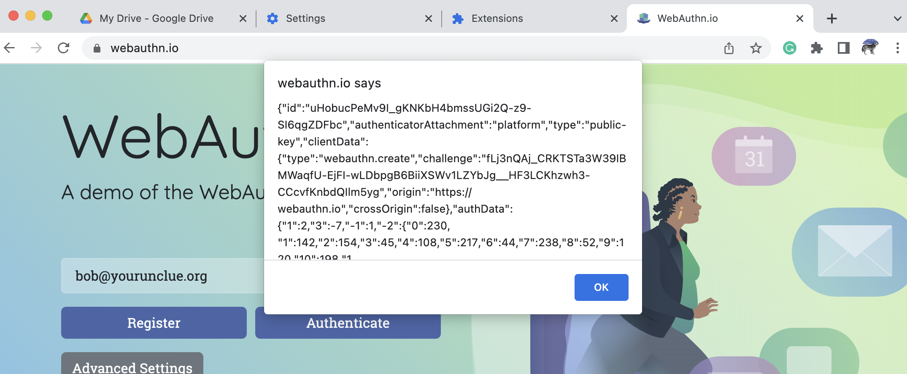
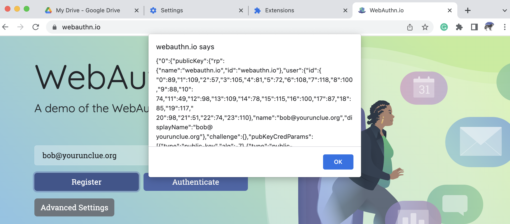
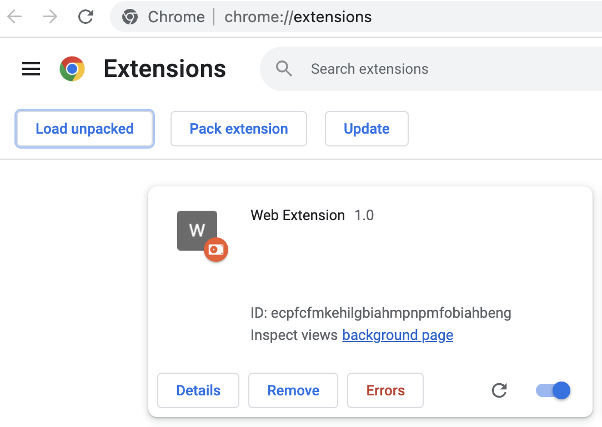

# webauthn-inspector

Lists json from the navigator.credentials.create endpoint in a modal:

Then lists the json returned in the modal:

## Installation
This is just a PoC so meant to be loaded as an unpacked Chrome extension for now.

